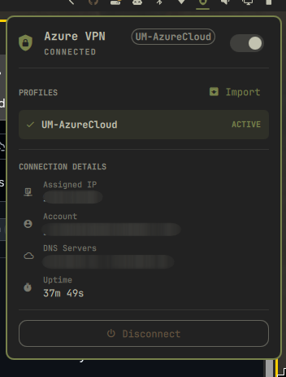

# Omarchy Azure VPN Plugin

A fast, lightweight, and completely headless **Microsoft Azure Point-to-Site (P2S) VPN** widget for the [Omarchy](https://omarchy.org/) desktop shell.



## Features

- **Headless & Fast**: Replaces the deprecated, bulky Flutter GUI client (`microsoft-azurevpnclient`) with a native OpenVPN/OpenP2S backend.
- **Microsoft Entra ID (Azure AD) SSO**: Authenticates with browser-based PKCE SSO and automatically caches and refreshes OAuth tokens.
- **Top Bar Integration**:
  - **Left-click**: Opens the connection panel with profile management and live telemetry.
  - **Right-click**: Instantly connects or disconnects the active profile.
  - **Status Indicator**: Glowing icon when connected, dimmed when disconnected.
- **Profile Management**: Import any standard Azure VPN `.xml` package directly from a file dialog or CLI.
- **Split DNS & Routing**: Automatically resolves enterprise DNS via `systemd-resolved` and routes only internal corporate subnets.
- **Systemd Managed**: Background tunnel managed as an isolated `systemd --user` service.

## Prerequisites & Installation

### 1. Install Plugin

You can add this plugin directly to Omarchy via git:

```bash
omarchy plugin add https://github.com/jellespijker/omarchy-azure-vpn.git --enable
```

### 2. Automatic Dependency Setup & Hardening

Azure VPN uses Microsoft Entra ID tokens which exceed standard OpenVPN buffer sizes. The plugin uses [`openp2s`](https://github.com/wyruweso/openp2s) with a patched OpenVPN binary.

Run the built-in setup wizard in your terminal:

```bash
azurevpn setup
```

This will:
1. Verify or automatically install `openp2s` and its companion OpenVPN binary into `/usr/local/bin` and `/usr/local/lib/openp2s`.
2. Configure a hardened, tightly-scoped sudoers rule in `/etc/sudoers.d/99-openp2s` so the tunnel connects in the background without password prompts.
3. Secure profile and token directory permissions (`0700` / `0600`).
4. Register the systemd user service (`azure-vpn.service`).

## Usage

### Importing a Profile
1. Click the Azure VPN icon on your Omarchy bar.
2. Click **Import** in the popout panel to select your Azure VPN `.xml` file.
3. Or from the command line:
   ```bash
   azurevpn import ~/Downloads/azurevpnconfig.xml
   ```

### Connecting
- **From the bar**: Click the bar widget and press **Connect**, or simply **right-click** the bar icon to toggle immediately.
- **From CLI**:
  ```bash
  azurevpn connect           # Connects active profile
  azurevpn disconnect        # Disconnects
  azurevpn toggle            # Toggles connection
  azurevpn status            # Shows IP, interface, DNS, uptime
  azurevpn list              # Lists available profiles
  azurevpn select <profile>  # Switches active profile
  ```

## Security & Hardening

- **Scoped Sudo Privileges**: Instead of granting full root access, the setup script scopes passwordless execution strictly to `/usr/local/lib/openp2s/openvpn`.
- **Token Protection**: Entra ID OAuth refresh tokens and configurations are restricted to mode `0700` (`~/.local/state/openp2s/` and `~/.config/azure-vpn/`).
- **Input Sanitization**: Profile names and XML inputs are strictly validated and sanitized to prevent path traversal or shell injection.

## License

MIT © Jelle Spijker
